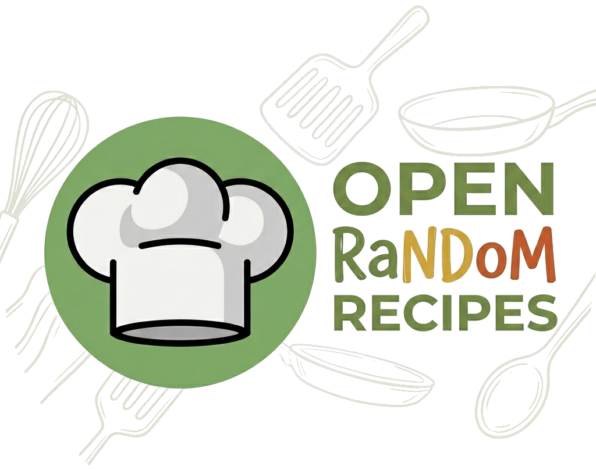

<div align="center">



# Random Recipes 🍽️

**Web application for recipe management and random weekly menu generation and the shopping list.**
_Simple. Private. Open Source. Not-for-profit._

[](LICENSE)
[](https://flutter.dev/)

</div>

---

*Read this document in other languages: [Español](README.es.md), [Português](README.pt.md)*

## Table of Contents 📚

- [Prerequisites](#prerequisites)
- [Installation](#installation)
- [Usage Guide](#usage-guide)
  - [Application Screens](#application-screens)
  - [Recipe Customization (`data/recipes.json`)](#recipe-customization-datarecipesjson)
- [Contributing](#contributing)
- [License](#license)

## Prerequisites 🛠️

To install and run this project in your local environment, you will need the following tools:

- **Node.js**: JavaScript runtime environment (LTS version recommended, minimum v18+).
- **npm**: Node package manager (installed alongside Node.js).
- **Git**: Version control system.

## Installation 📦

Follow these steps to get the project running on your local machine:

1. **Clone the repository**:
   ```bash
   git clone <REPOSITORY_URL>
   cd open-random-recipes
   ```

2. **Install dependencies**:
   ```bash
   npm install
   ```

3. **Configure environment variables**:
   Copy the example file to create your own `.env` file:
   ```bash
   cp .env.example .env
   ```
   
   Open the `.env` file and fill in the following variables for the authentication process:
   - `APP_PASSWORD_HASH_B64`: Base64 encoded bcrypt password hash. You can generate one using `bcryptjs` in a Node script or online tools. For example:
     ```javascript
     // Quick Node script to generate the hash:
     const bcrypt = require('bcryptjs');
     const hash = bcrypt.hashSync('your_secret_password', 10);
     const hashB64 = Buffer.from(hash).toString('base64');
     console.log(hashB64);
     ```
   - `SESSION_SECRET`: A 64-character random hexadecimal string. You can generate it in your terminal using:
     ```bash
     openssl rand -hex 32
     ```

4. **Start the development server**:
   ```bash
   npm run dev
   ```
   The application will be available at `http://localhost:3000`.

## Usage Guide 📖

Below are the main features of the application.

> **TO-DO**: insert screenshots of the running application here to illustrate the guide. Save the images in `public/docs/`

### Application Screens 📱

#### 1. Home Screen 🏠
This is the main view when entering the application. It allows you to navigate to different sections.
** 

#### 2. Recipes List 📋
In this screen, you can view all the available recipes in the system, along with their images, names, and general information.
**

#### 3. Menu Generator 🍲
This is the core functionality. It allows you to generate a weekly menu randomly, taking into account restrictions and meal types (breakfast, lunch, dinner).
**

#### 4. Shopping List 🛒
Based on the generated menu, this screen groups all the necessary ingredients categorized by their grocery section (produce, meat, dairy, etc.).
**

#### 5. Settings ⚙️
In this screen, you can customize the application behavior:
- **Theme**: Toggle between light and dark mode.
- **Language**: Change the application's interface language.
- **Training Days**: Set which days of the week you train to generate specific meals according to your active days.
**

### Recipe Customization (`data/recipes.json`) 📂

The entire recipe database is managed through the static `data/recipes.json` file. It is structured as a JSON array of objects, where each object represents a recipe.

To add your own recipes so the app uses them when generating menus, simply edit or add new objects following this structure:

- **`id`** *(number)*: A unique identifier for the recipe.
- **`name`** *(string)*: The title of the recipe.
- **`steps`** *(string)*: Preparation instructions.
- **`restrictions`** *(array of strings | null)*: Tags to restrict when this recipe can be suggested. Possible values: `["weekend"]`, `["dinner"]`, etc. If there are no restrictions, use `null`.
- **`servings`** *(number)*: Number of servings.
- **`breakfast`, `lunch`, `snack`, `dinner`** *(boolean)*: Set to `true` or `false` to indicate which meals of the day this recipe fits into.
- **`ingredients`** *(array of objects)*: List of ingredients. Each ingredient has:
  - `name` *(string)*: Name of the ingredient or category.
  - `quantity` *(number | null)*: Required quantity.
  - `unit_of_measure` *(string | null)*: Unit (e.g., "grams", "ml").
  - `required` *(boolean)*: Whether the ingredient is mandatory.
  - `grocery_section` *(string)*: Supermarket section to organize the shopping list (e.g., `"Frutas y Verduras"`, `"Carnicería"`, `"Lácteos"`, `"Cereales y Granos"`).
  - `options` *(array of strings, optional)*: If it's an open recipe (e.g., "White meat"), list the possible options here (e.g., `["Chicken breast", "Turkey"]`).
- **`img`** *(string)*: Path to the recipe image (usually saved in the `public/recipes/` folder).

**Example of adding a recipe:**
```json
{
  "id": 99,
  "name": "Tomato Toast",
  "steps": "Toast the bread, grate the tomato, and add oil and salt.",
  "restrictions": null,
  "servings": 1,
  "breakfast": true,
  "lunch": false,
  "snack": true,
  "dinner": false,
  "ingredients": [
    {
      "name": "Bread",
      "quantity": 2,
      "unit_of_measure": "slices",
      "required": true,
      "grocery_section": "Panadería"
    },
    {
      "name": "Tomato",
      "quantity": 1,
      "unit_of_measure": "unit",
      "required": true,
      "grocery_section": "Frutas y Verduras"
    }
  ],
  "img": "/recipes/tomato-toast.jpg"
}
```

## Contributing 🤝

Contributions are welcome! If you want to collaborate with the project:

1. Check the **Issues** tab to see pending tasks or report a new bug/feature.
2. Fork the repository.
3. Create a new branch for your feature (`git checkout -b feature/new-feature`).
4. Commit your changes (`git commit -m 'Add new feature'`).
5. Push to the branch (`git push origin feature/new-feature`).
6. Open a **Pull Request** detailing your changes.

## License 📄

This project is licensed under the **GNU Affero General Public License v3.0 (AGPL-3.0)**.

**License Summary:**
- **You can**: Use, modify, and distribute this software publicly or privately (not comercially).
- **You must**:
  - Provide the complete source code to any user interacting with the software over a network (such as a web server).
  - Keep the same license (AGPL-3.0) if you distribute or publish a modified version.
  - Include the copyright notice and the original license declaration.
- **You cannot**: Close the source code if you offer the software as a public web service.

For more details, see the full [LICENSE](LICENSE) file in the repository.
